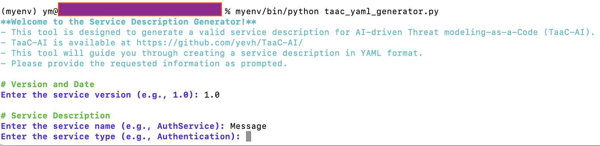
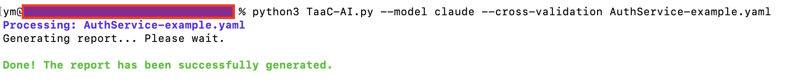
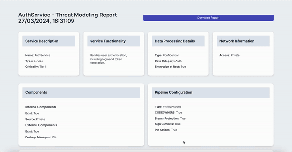
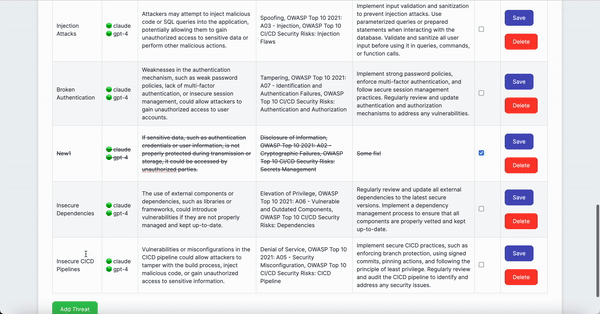
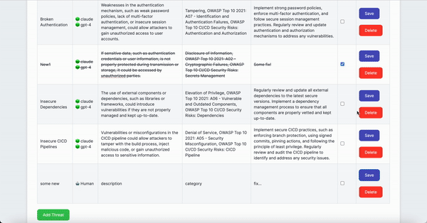

# AI-driven Threat Modeling-as-a-Code (TaaC-AI)

It leverages AI to analyze service descriptions, identify security threats, visualize data flow and suggest remediations based on the STRIDE framework and OWASP guidelines. The script generates in-depth HTML report and includes feature for manual risk assessment.

## Design


## How It Works

- **YAML File Processing:** Loads and validates a YAML file containing the service details
- **AI Threat Analysis:** If an OpenAI API key is provided, the script uses AI to generate a comprehensive threat modeling analysis
- **AI Threat Cross validation:** Various LLMs performs a validation results
- **Data Flow Generation:** Automatically generates a visual representation of the data flow within the service
- **Manual Risk Management:** Users can manually add, modify, or cross out risks in the generated report
- **Report Generation:** Produces a detailed HTML report, including both AI-generated and manually added risks

## Model supported

- GPT-3.5
- GPT-4
- Claude 3 Haiku
- Mistral 7b (through ollama)
- ‎Gemini (Planned)

## Set API Key

Set the openai api key as an environment variable OPENAI_KEY and ANTHROPIC_KEY in your operating system

[OpenAI API](https://openai.com/blog/openai-api)
[Anthropic API](https://docs.anthropic.com/claude/reference/getting-started-with-the-api)

**Linux/Mac**

```bash
export OPENAI_KEY=sk-ApiKeyExample
```

```bash
export ANTHROPIC_KEY=sk-ant-api03-ApiKeyExample
```

**Windows**

```bash
set OPENAI_KEY=sk-ApiKeyExample
```

```bash
set ANTHROPIC_KEY=sk-ant-api03-ApiKeyExample
```

## Install dependencies 

```bash
pip3 install -r requirements.txt
```
## Install Mistral and Ollama

1. Download and install Ollama [ollama.ai](https://ollama.ai)
2. Install Mistral

```bash
ollama pull mistral
```
3. Start ollama service (make sure the Ollama desktop app is closed)

```bash
ollama serve
```
Now you can use mistral as the main model:

```bash
python3 TaaC-AI.py --model mistral <path_to_yaml_file>
```
Or for cross-validation

```bash
python3 TaaC-AI.py --model claude --cross-validation mistral <path_to_yaml_file>
```

## How to Use ❓
1. Create a valid service description using [these guidelines](src/template.md) or use ```taac_yaml_generator.py``` that will guide you through the process of generating one


   
2. Execute the script (GPT-3.5 is used by default)

```bash
python3 TaaC-AI.py <path_to_yaml_file>
```

Use ```gpt-4```, ```claude``` or ```mistral``` as a model to identify threats by specifying the ```--model``` option

```bash
python3 TaaC-AI.py --model gpt-4 <path_to_yaml_file>
```

To perform Threats result validation by another LLM use ```--cross-validation``` option.

```bash
python3 TaaC-AI.py --model claude --cross-validation claude <path_to_yaml_file>
```

3. Open generate .html report
4. Review/Edit AI-driven Threat Modeling Analysis table, and for false positives or resolved issues, mark the 'Status' checkbox
5. Add manually identified threats to the table (optional)
6. Download the report via the Download Report button 

## Usage Example 🏁

1. Valid service description example
```yaml
Version: '1.0'
Date: 14.11.2023

# Authentication Service Description
Description:
  Name:  AuthService
  Type: Service
  Criticality: Tier1

# Service Functionality
Functionality: Handles user authentication, including login and token generation.

# Data Processing Details
DataProcessed: 
  Type: Confidential
  DataCategory: Auth
  EncryptionAtRest: Yes

# Components Used by the Service
Components:
  Internal: 
    Exist: Yes
    Source: Private
    Note: Scoped Package Access
  External: 
    Exist: Yes
    PackageManager: NPM

# Pipeline Configuration
Pipeline:
  Type: GithubActions
  CODEOWNERS: Yes
  BranchProtection: Yes
  SignCommits: Yes
  PinActions: Yes
  
# Network Information
Network:
  Access: Private

# Authentication Service Data Flow
dataFlow:  # Removed the dash here
  - name: UserAuthenticationFlow
    description: Authenticates users and issues tokens.
    source: UserLoginInterface
    EncryptionTransit: Yes
    Authentication:
      Exist: Yes
      Type: JWT
    Authorization: read-write
    Protocol: HTTPS
    Communication:
      Type: RESTful API
    interactions:
      - from: UserLoginInterface
        to: AuthService
        method: RESTful API
        protocol: HTTPS
      - from: AuthService
        to: UserDatabase
        method: Query
        protocol: JDBC
    servicesInvolved: [UserLoginInterface, AuthService, UserDatabase]
```
2. Script execution

3. Download and Review the generated [HTML report](src/AuthService_2024-03-27_ThreatModelingReport.html)
   
   

5. Add Threats manually

 

6. Download the latest report

 

## Roadmap 🗓️

- ~~Template Design~~
- ~~Basic Functionality~~
- ~~GPT-3 Integration~~
- ~~Report generation~~
- ~~Manually adding identified threats~~
- ~~GPT-4 Integration~~
- ~~Claude Integration~~
- ~~LLM Cross Validation~~
- ~~Mistral Integration via Ollama~~
- ‎Gemini Integration
- Accuracy Comparison

## Contact 📧

All suggestions write to yevhsec1@gmail.com
