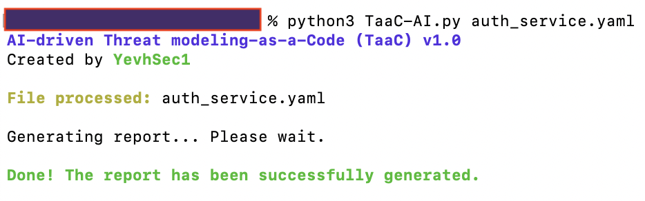
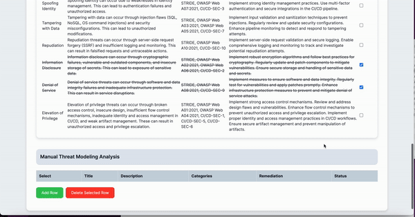

# AI-driven Threat Modeling-as-a-Code (TaaC)

It leverages AI (via OpenAI's GPT models) to analyze service descriptions, identify security threats, visualise data flow and suggest remediations based on the STRIDE framework and OWASP guidelines. The script generates in-depth HTML report and includes feature for manual risk management.

## How It Works

- **YAML File Processing:** Loads and validates a YAML file containing the service details
- **AI Threat Analysis:** If an OpenAI API key is provided, the script uses AI to generate a comprehensive threat modeling analysis
- **Data Flow Generation:** Automatically generates a visual representation of the data flow within the service
- **Manual Risk Management:** Users can manually add, modify, or cross out risks in the generated report
- **Report Generation:** Produces a detailed HTML report, including both AI-generated and manually added risks

## Model supported

- GPT-3.5
- GPT-4 (Soon)
- Claude (Planned)
- Mixtral 7b (Planned)
- Palm-2-chat-bison (Future)
- yi-34b-chat (Future)
- llama-2-70b (Future)

## Install dependencies 

```bash
pip3 install -r requirements.txt
```

## How to Use ❓

1. Create a valid service description using [this guidulines](src/template.md)
2. Execute the script
```bash
python3 TaaC-AI.py <path_to_yaml_file>
```
3. Open generate .html report
4. Review AI-driven Threat Modeling Analysis table, and for false positives or resolved issues, mark the 'Status' checkbox
5. Add manually identified threats to the Manual Threat Modeling Analysis table (optional)
6. Download the report via the Download Report button 

## Usage Example 🏁

1. Valid service description example
```yaml
Version: '1.0'
Date: 14.11.2023

# Authentication Service Description
Description:
  Name:  AuthService
  Type: Service
  Criticality: Tier1

# Service Functionality
Functionality: Handles user authentication, including login and token generation.

# Data Processing Details
DataProcessed: 
  Type: Confidential
  DataCategory: Auth
  EncryptionAtRest: Yes

# Components Used by the Service
Components:
  Internal: 
    Exist: Yes
    Source: Private
    Note: Scoped Package Access
  External: 
    Exist: Yes
    PackageManager: NPM

# Pipeline Configuration
Pipeline:
  Type: GithubActions
  CODEOWNERS: Yes
  BranchProtection: Yes
  SignCommits: Yes
  PinActions: Yes
  
# Network Information
Network:
  Access: Private

# Authentication Service Data Flow
dataFlow:  # Removed the dash here
  - name: UserAuthenticationFlow
    description: Authenticates users and issues tokens.
    source: UserLoginInterface
    EncryptionTransit: Yes
    Authentication:
      Exist: Yes
      Type: JWT
    Authorization: read-write
    Protocol: HTTPS
    Communication:
      Type: RESTful API
    interactions:
      - from: UserLoginInterface
        to: AuthService
        method: RESTful API
        protocol: HTTPS
      - from: AuthService
        to: UserDatabase
        method: Query
        protocol: JDBC
    servicesInvolved: [UserLoginInterface, AuthService, UserDatabase]
```
2. Script execution

3. Download and Review the generated [HTML report](src/AuthService_2024-01-03_ThreatModelingReport.html)
   
   

5. Add Threats manually

 

6. Download the latest report

 

## Roadmap 🗓️

- ~~Template Design~~
- ~~Basic Functionality~~
- ~~GPT-3 Integration~~
- ~~Report generation~~
- ~~Manually adding identified threats~~
- GPT-4 Integration 🔜 
- Claude Integration 
- Mixtral 7b Integration 
- Palm-2-chat-bison Integration
- yi-34b-chat Integration
- llama-2-70b Integration
- Accuracy Comparison

## Contact 📧

All suggestions write to yevhsec1@gmail.com
